# 🗺 Загрузка трасс

*[English version](README.md)*

Формат данных мода не привязан к конкретной игре. Binary использует контейнер `mod.cxmod`, Wavefront — раздельные файлы. Сейчас реализован только тип контента `map`. Игре-потребителю нужны совместимый загрузчик и адаптеры рендера, физики и игровых маркеров. Площадка публикации не определяет формат файла.

Пошаговая инструкция: как подготовить трассу в Unity-проекте и опубликовать её.

Текущий интерфейс MapBuilder публикует на **mod.io** или экспортирует в локальную папку. Настройка площадки описана в **[PUBLISHING.md](PUBLISHING.md)**.

- [Подготовка проекта](#подготовка-проекта)
- [Импорт 3D-модели в проект](#импорт-3d-модели-в-проект)
- [Основные компоненты](#основные-компоненты)
  - [Настройка поверхностей и столкновений](#настройка-поверхностей-и-столкновений)
  - [Точка появления машины](#точка-появления-машины)
  - [Система шаблонов (только для дороги)](#система-шаблонов-только-для-дороги)
  - [Мини-карта](#мини-карта)
  - [Съёмка изображений: иконка, превью, мини-карта](#съёмка-изображений-иконка-превью-мини-карта)
- [Публикация карты](#публикация-карты)
  - [Настройки сборки](#настройки-сборки)
  - [Формат мода: Wavefront и Binary](#формат-мода-wavefront-и-binary)
  - [Настройки загрузки](#настройки-загрузки)
- [Проверка карты](#проверка-карты)
- [Поддерживаемые компоненты](#поддерживаемые-компоненты)
- [Требования](#требования)

## Подготовка проекта

1. Получите проект. В репозитории есть **git-сабмодуль** (`Assets/Plugins/CarX.Modding.Creator`), поэтому клонируйте
   его через `git`, а не скачивайте ZIP:

   ```bash
   git clone --recurse-submodules https://github.com/CarXTechnologies/dro-map-uploader
   ```

   > [!WARNING]
   > **Code → Download ZIP** *не* включает сабмодули — папка `Assets/Plugins/CarX.Modding.Creator` останется пустой,
   > и проект не скомпилируется.


2. Установите **Unity Editor 6000.3.19f1** (только 64-бит): **[скачать установщик](https://download.unity3d.com/download_unity/7689f4515d75/Windows64EditorInstaller/UnitySetup64-6000.3.19f1.exe)**.

   > [!IMPORTANT]
   > Версия должна совпадать точно. Она записана в `ProjectSettings/ProjectVersion.txt`, и открытие проекта другим
   > редактором обновит его на месте — это изменение, которого вы не просили и которое непросто откатить.
3. Запустите Unity, выберите **File → Open Project** и укажите папку проекта (в ней должны быть папки `Assets` и
   `Packages`).

После открытия проекта переходите к следующему шагу.

### Обновление уже склонированного проекта

Если репозиторий был склонирован без `--recurse-submodules` или после изменений, затрагивающих сабмодуль:

```bash
git submodule update --init --recursive
```

Чтобы подтянуть всё актуальное, включая сабмодули:

```bash
git pull --recurse-submodules
git submodule update --init --recursive
```

Чтобы полностью сбросить рабочую копию и загрузить всё заново — **это удалит все локальные изменения**, включая
неотслеживаемые файлы:

```bash
git reset --hard
git clean -xffd                     # второй -f удаляет и неотслеживаемые папки сабмодулей
git submodule update --init --recursive --force
```

Если сабмодуль не скачивается по SSH (`git@github.com: Permission denied`), переключите git на HTTPS:

```bash
git config --global url."https://github.com/".insteadOf git@github.com:
git submodule update --init --recursive
```

## Импорт 3D-модели в проект

1. В `Assets/MapResources/` создайте папку с именем вашей карты.
2. Внутри неё создайте сцену через **Assets → Create → Scene**.
3. Перетащите модель `.fbx` / [`.obj`](https://www.autodesk.com/products/fbx/overview) /
   [`.dae`](https://www.khronos.org/collada/) в `Assets/MapResources/<ваша_папка>/`.
4. Если модели пришли без материалов, создайте их через **Assets → Create → Material** и настройте, как показано ниже.

   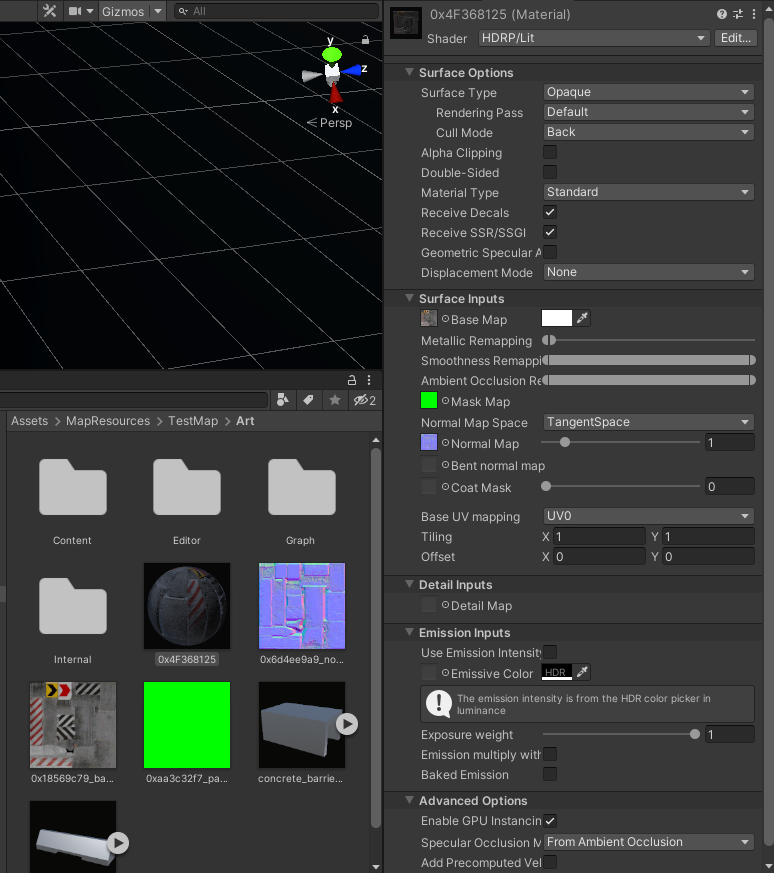

5. Откройте созданную сцену и перетащите в неё модель — получится GameObject.
6. Добавьте на этот объект нужные компоненты.
7. Чтобы объект можно было переиспользовать (Prefab), создайте папку `Assets/MapResources/<ваша_папка>/Prefabs`.
8. Нажмите на объекте в сцене правой кнопкой и выберите **Prefab → Unpack Completely**.
9. Перетащите объект из сцены в созданную папку `Prefabs` — теперь его можно использовать сколько угодно раз.

   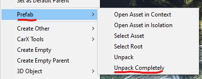

В сцене может быть несколько объектов верхнего уровня. Общий родитель с именем `root` необязателен: сборщик экспортирует все корни сцены, не переподчиняя исходные объекты. Старые карты с группой `root` продолжают поддерживаться. Сборщик не создаёт временные сцены. Связи Rigidbody и Animation и объединение одинаковых атласов анимации работают в пределах всей экспортируемой сцены.

## Основные компоненты

Проект поддерживает несколько типов компонентов, которые переносятся в игру. Главные из них:

- точка появления машины на карте,
- физические материалы поверхностей.

Эти компоненты назначаются через помощник **GameMarkerData**. Чтобы добавить его на GameObject или префаб, нажмите
**Add Component** в инспекторе и введите `GameMarkerData`. Также можно добавить мини-карту.

### Настройка поверхностей и столкновений

Для объекта трассы, который является поверхностью, задайте в GameMarkerData тип **Road** и выберите в выпадающем
списке материал, который будет использоваться в игре при взаимодействии с этой поверхностью.

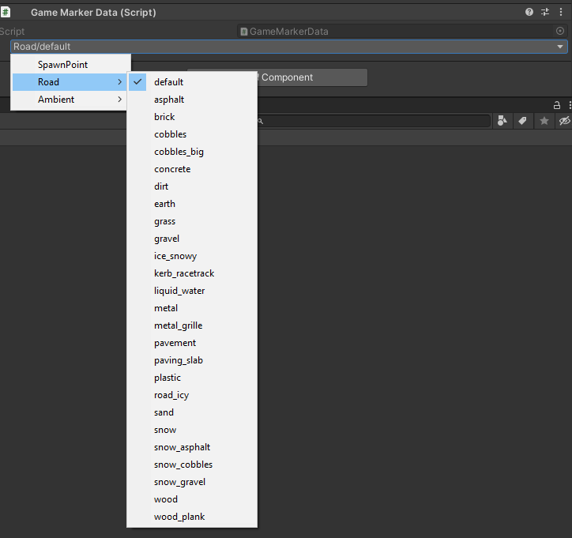

> [!NOTE]
> На любом GameObject/префабе со столкновениями должен быть компонент Collider (Box / Sphere / Capsule / Mesh
> Collider). Без него столкновения работать не будут.

### Точка появления машины

Создайте пустой объект через **GameObject → Create Empty** (или <kbd>Ctrl</kbd>+<kbd>Shift</kbd>+<kbd>N</kbd>). В
компоненте Transform задайте координаты, где машина должна появляться в игре. Добавьте компонент **GameMarkerData** и
выберите тип **SpawnPoint**.

> [!IMPORTANT]
> Оба формата поддерживают несколько точек появления — давайте
> объектам осмысленные имена, потому что имя экспортируется вместе с точкой и опознаёт её в игре.

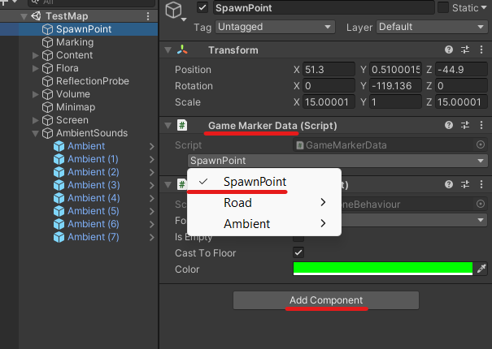

### Вершинная анимация

Используйте **Animation** с Animator для запекания анимации в атлас. Типы **Ambient**, **TimeObjectActivator** и **NetworkObject** не поддерживаются. Сетевую физику задаёт компонент Rigidbody; отдельный маркер для неё не нужен.

### Система шаблонов (только для дороги)

1. Создайте конфиг шаблонов.

   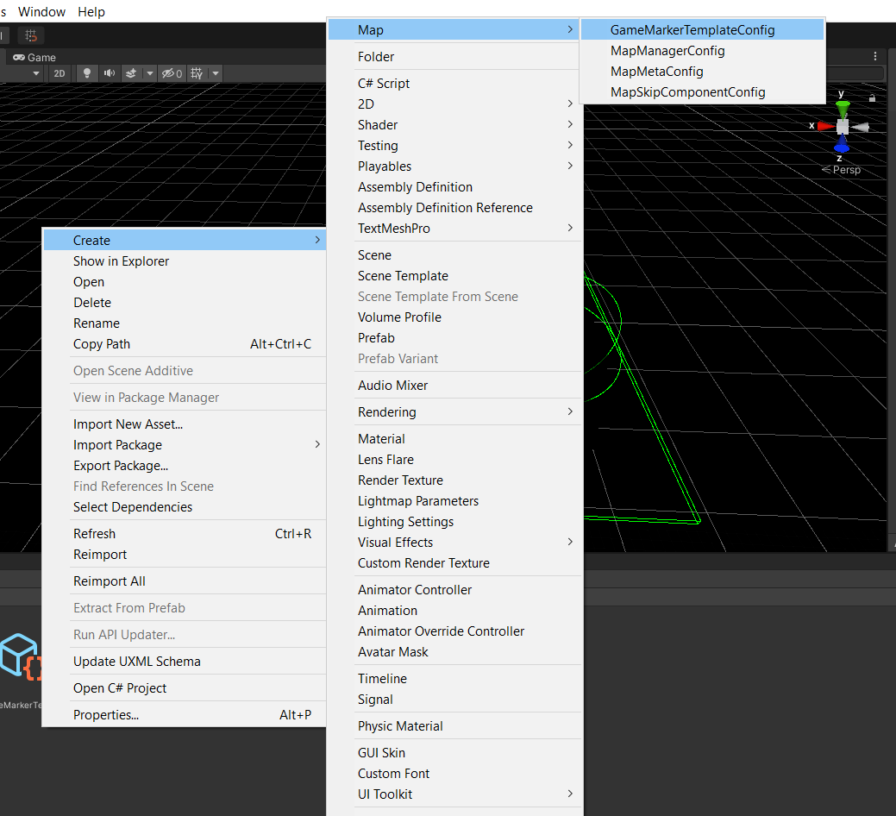

2. Создайте шаблоны и переопределите их параметры.

   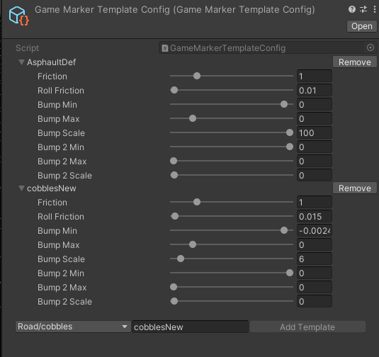

3. Выберите конфиг шаблонов в компоненте GameMarkerData.

   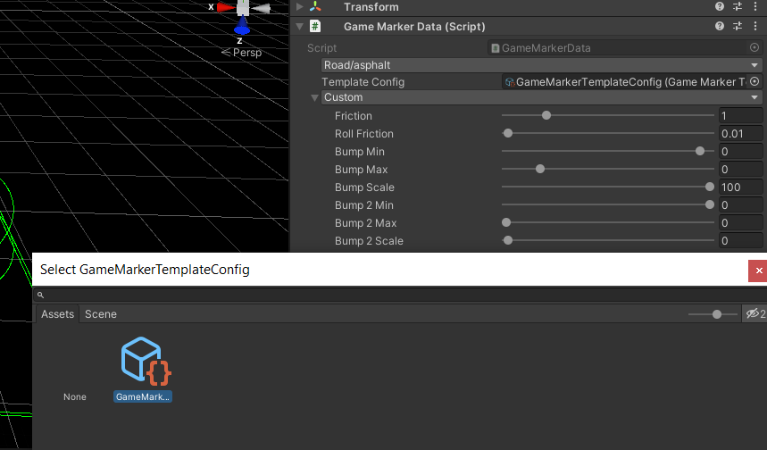

4. Выберите шаблон, чтобы переопределить параметры.

   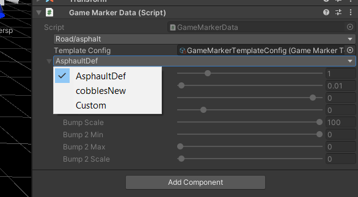

### Мини-карта

На каждой карте должна быть ровно одна мини-карта. Создайте пустой объект в сцене (как описано выше), добавьте
компонент **Minimap** и выберите Minimap Layer. В **Textures → Element 0** назначьте хотя бы одну текстуру —
MainTexture. При настройке можно воспользоваться вспомогательными функциями: сгенерировать заготовку, открыть её в
графическом редакторе и нарисовать поверх свою мини-карту.

- **Bound center** — смещение мини-карты относительно центра.
- **Bound size** — размер карты в мировых координатах.

> [!NOTE]
> Карта должна быть отцентрована относительно нулевых координат.

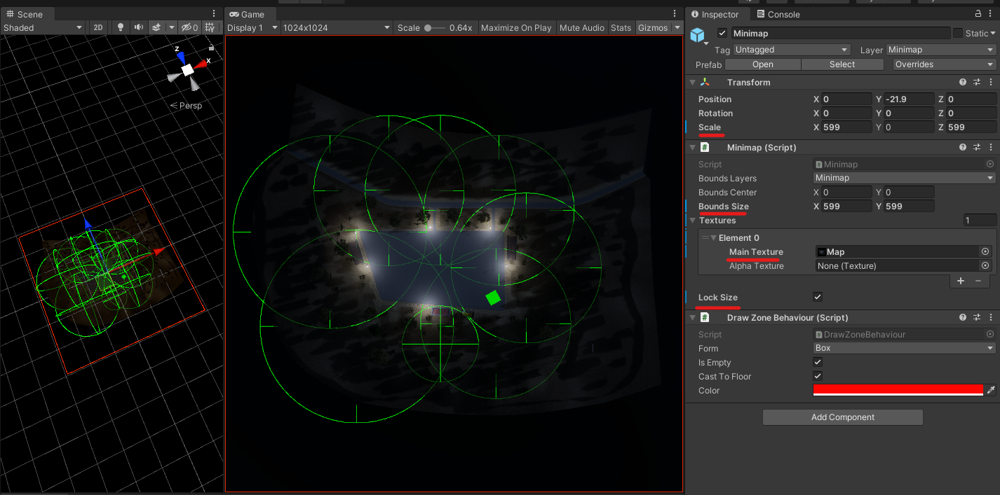

### Съёмка изображений: иконка, превью, мини-карта

1. Добавьте компонент **CaptureCamera** на GameObject с камерой.
2. Настройте камеру под нужный кадр.
3. Нажмите **Capture** внизу компонента в инспекторе.
4. Сохраните результат на диск.

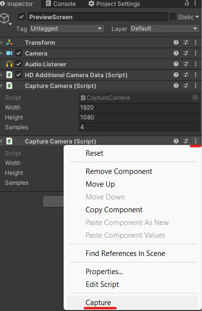

## Публикация карты

1. Откройте **Tools → MapBuilder**. В шапке находятся аккаунт, **Platform** (сейчас mod.io) и переключатель **EN / RU**. По умолчанию выбран английский; ниже используются подписи английского интерфейса.
2. Выберите карту в **Local maps** или нажмите **+ New map**, чтобы создать файл её настроек. Существующие `MapMetaConfig` автоматически появляются в библиотеке; выбирать конфиг отдельно на каждой вкладке не нужно.
3. На вкладке **Map** заполните **Name**, **Version**, **Summary**, **Description**, **Authors**, **URL**, **Preview** и **Icon**. Version — версия релиза автора, например `1.2.0`, а не версия формата контейнера. Пустое значение заменяется на `1.0.0`. Для пустого Summary используется первая строка описания. Для Icon и Preview используйте PNG с включённым Read/Write.

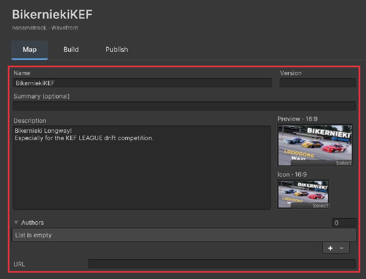

### Настройки сборки

Откройте **Build**. Если нужной сцены нет в **Scene**, добавьте её в список сцен сборки Unity.

| Элемент | Назначение |
| --- | --- |
| **Scene** | Сцена для экспорта. |
| **Format** | Binary (по умолчанию) или Wavefront. |
| **Advanced settings** | Открывает **Rebuild targets** и для Binary — **Binary textures** (BC7 или RGBA32 с готовыми mip-уровнями). Сжатие контейнера автоматическое. |
| **Scene contents** | Показывает количество компонентов и лимиты. |
| **Validate map** | Проверяет карту без сборки. См. [Проверка карты](#проверка-карты). |
| **Build map** | Собирает выбранные цели. Для полной сборки используйте Everything. |
| **Open build folder** | Открывает результат сборки. |
| **Go to publishing →** | Переходит к Publish. |

Прогресс и **Cancel** отображаются в нижней панели. Часть операций Unity выполняется в потоке редактора, поэтому во время отдельных этапов он может отвечать медленнее.

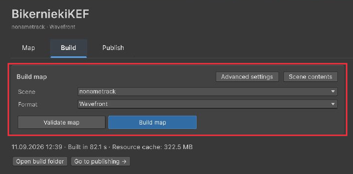

### Формат мода: Wavefront и Binary

- **Wavefront** — геометрия, материалы, текстуры и метаданные в OBJ / MTL / PNG / JSON.
- **Binary** — сжатый контейнер `mod.cxmod` с компактной геометрией, типизированными данными сцены и подготовленными текстурами. Выбран по умолчанию.

Оба формата экспортируют все корни сцены и поддерживают одинаковые компоненты. После смены формата пересоберите **Map и Meta**. Поддерживаются только карты (`contentType: "map"`). Формат не привязан к конкретной игре; приложению-потребителю нужны совместимые адаптеры.

Подробнее: [экспорт Wavefront](Wavefront.md) и [бинарный формат](BinaryFormat.md).

### Настройки загрузки

На вкладке **Publish** выберите **Platform** для публикации на mod.io или **Export to folder** для локальной копии. Сборка и локальный экспорт не требуют публикации.

1. Сначала соберите Map и Meta; для публикации войдите в аккаунт через шапку окна.
2. Для нового мода нажмите **Create publication**: создаётся запись и загружаются собранные файлы. После привязки записи пересоберите Meta с полученным id и нажмите **Update publication**.
3. Для существующего мода выберите запись в **Publications**, заполните **Changelog**, настройте **Update title / Update description / Update preview** и нажмите **Update publication**. Переключатели определяют обновление полей страницы публикации.
4. **Refresh list** обновляет список публикаций. В библиотеке карт показывается версия связанного файла на mod.io, если она загружена; это отдельное значение от редактируемой локальной Version.

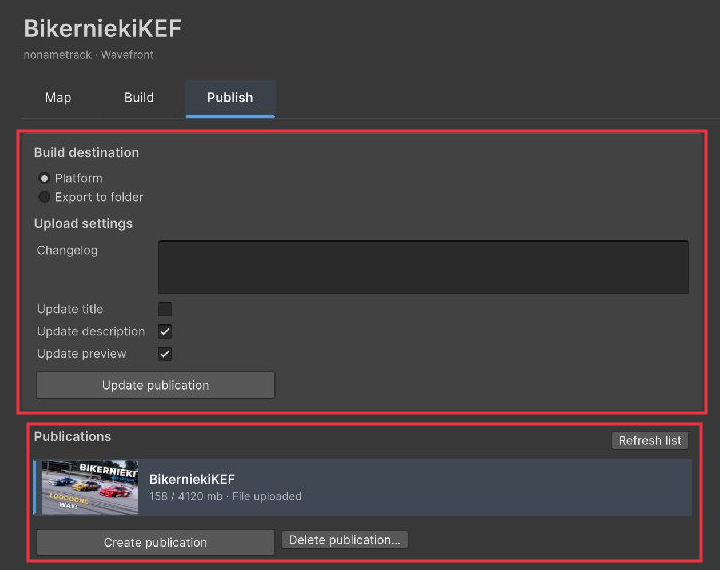

Для локального тестирования выберите **Export to folder**, задайте **Folder** и нажмите **Export to folder**. Укажите каталог модов приложения-потребителя. В текущем интерфейсе нет Steam Local Test.

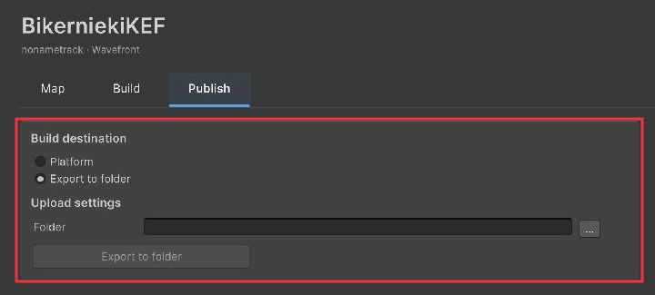

Настройка площадки и детали интеграции: [PUBLISHING.md](PUBLISHING.md).

## Проверка карты

Кнопка **Validate map** на вкладке **Build** проверяет карту, ничего не собирая. Сцена при этом не изменяется, так
что запускать проверку можно сколько угодно — это самый быстрый способ понять, готова ли карта.

Те же проверки выполняются автоматически при сборке. В обоих случаях результат открывается в окне **Map Validation**:
всё найденное за один проход, у каждой строки кнопка **Select**, которая переводит к виноватому объекту. В консоль
попадает только одна итоговая строка — кнопка **To console** в окне выгружает туда полный список, а **Copy**
копирует его в буфер обмена.

- **Ошибки** останавливают сборку. Исправляйте все сразу — они специально показываются вместе, чтобы не находить их
  по одной за пересборку.
- **Предупреждения** ничего не останавливают, и сообщают о пропущенном содержимом или других замечаниях.

Что проверяется:

| Область | Проверки |
| --- | --- |
| Мета | Название задано, допустимые символы и длина в пределах лимита площадки; длина описания и summary; иконка назначена, читаема, в PNG и в пределах лимита; превью читаемо и не больше 10 МБ |
| Компоненты | Всё по списку [поддерживаемых компонентов](#поддерживаемые-компоненты) и лимитам на каждый тип; потерянные (удалённые) скрипты |
| Маркеры | Наличие точки появления; повторяющиеся имена точек; маркеры без типа; Road без Collider |
| Формат | Неэкспортируемые компоненты; необязательные компоненты превью отмечаются информационно |
| Освещение | Больше одного Directional Light; типы света, которые Wavefront не экспортирует |
| Геометрия | Рендереры без меша и с пустыми слотами материалов; MeshCollider без меша; LODGroup больше 8 уровней или без рендереров |
| Физика | Невыпуклый MeshCollider на некинематическом Rigidbody |
| Мини-карта | Bound Size остался нулевым; отсутствующие текстуры или текстуры не типа Texture2D |

Объекты с тегом **Garbage** пропускаются — ровно так же, как при сборке.

## Поддерживаемые компоненты

| Категория | Компоненты |
| --- | --- |
| **Физика** | MeshCollider, BoxCollider, SphereCollider, CapsuleCollider, Rigidbody |
| **Геометрия** | MeshRenderer, MeshFilter, LODGroup |
| **Свет** | Point и Spot Light, HDAdditionalLightData |
| **Анимация** | Animator и SkinnedMeshRenderer внутри GameMarkerData Animation, запекаемые в VAT |
| **Данные карты** | SpawnPoint, Road, Animation; Minimap |

Volume и ReflectionProbe разрешены только для превью и не обязательны. Неподдерживаемые компоненты (включая UI, частицы, видео и Joint) и типы маркеров пропускаются с предупреждениями, без блокировки сборки. Rigidbody без пригодных коллайдеров пропускается; его визуальная геометрия по-прежнему может экспортироваться. Правила и лимиты находятся в `Assets/Editor/MapSceneRules.cs`.

## Требования

- Не используйте несколько источников Directional Light.
- Размер карты — не больше 4 ГБ.
- Размер меты — не больше 24 МБ (включая превью, иконку, описание и название).
- Учитывайте ограничения по компонентам.

В текущем конфиге mod.io заданы следующие лимиты; администратор проекта может изменить их в настройках площадки:

| Поле | Лимит |
| --- | --- |
| Иконка / логотип | 8 МБ |
| Name | 50 символов |
| Description | 50000 символов |
| Summary | 250 символов |

Невыпуклый MeshCollider на некинематическом Rigidbody требует исправления. Само наличие неподдерживаемых компонентов не блокирует сборку.

Новые публикации создаются скрытыми. Проверьте загруженный файл на mod.io и измените видимость на странице мода, когда он будет готов.
